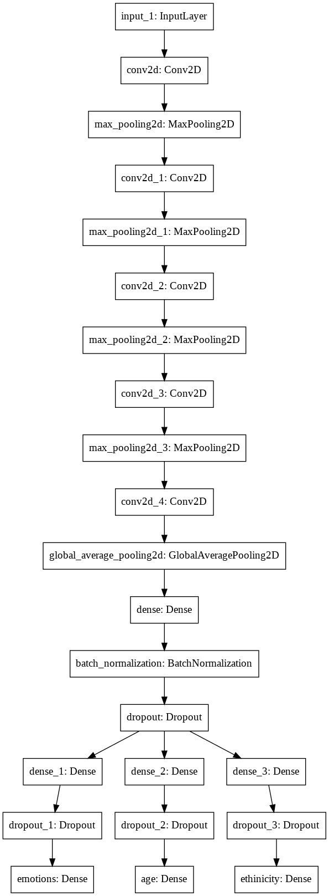
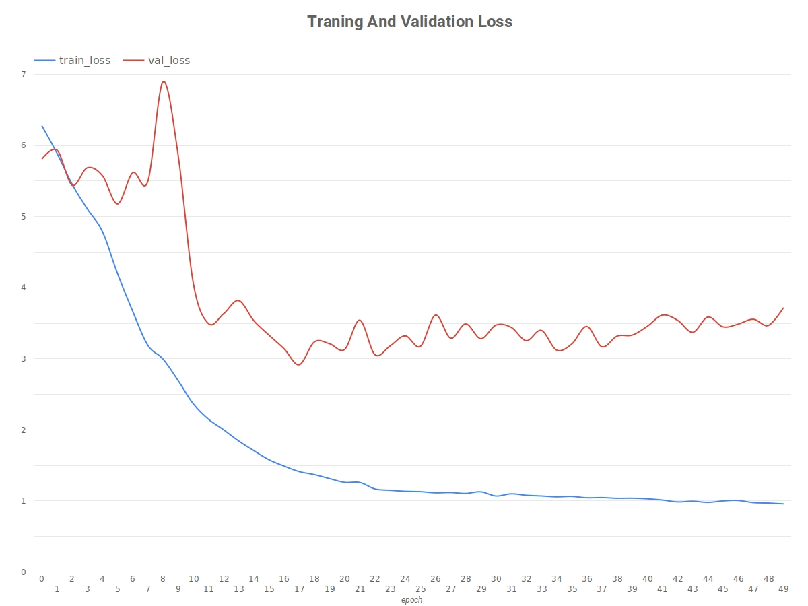
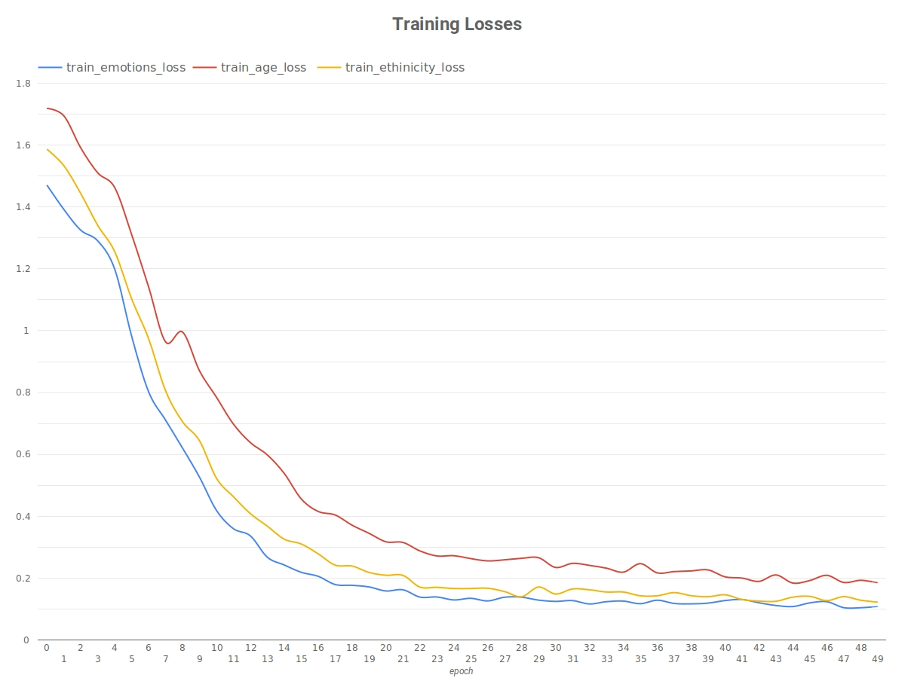
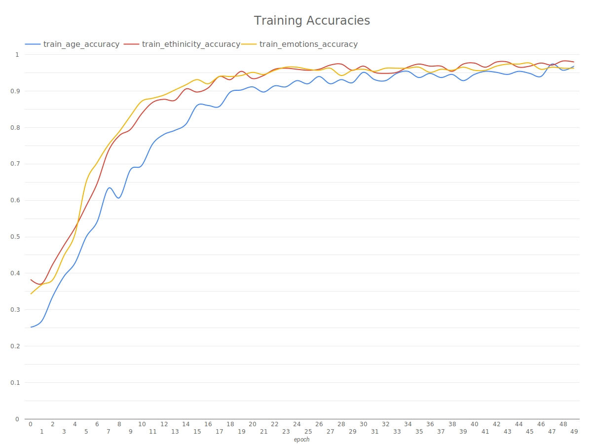
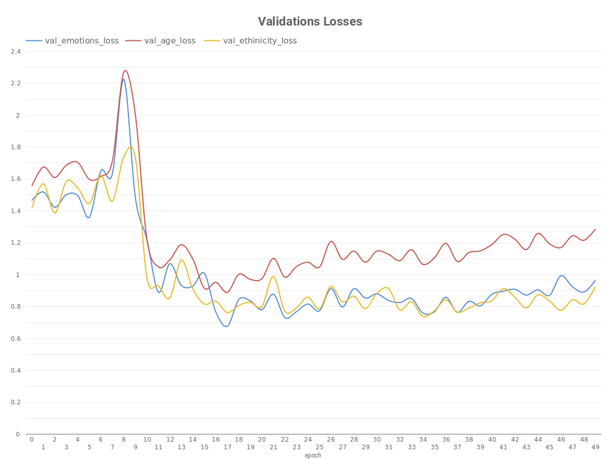
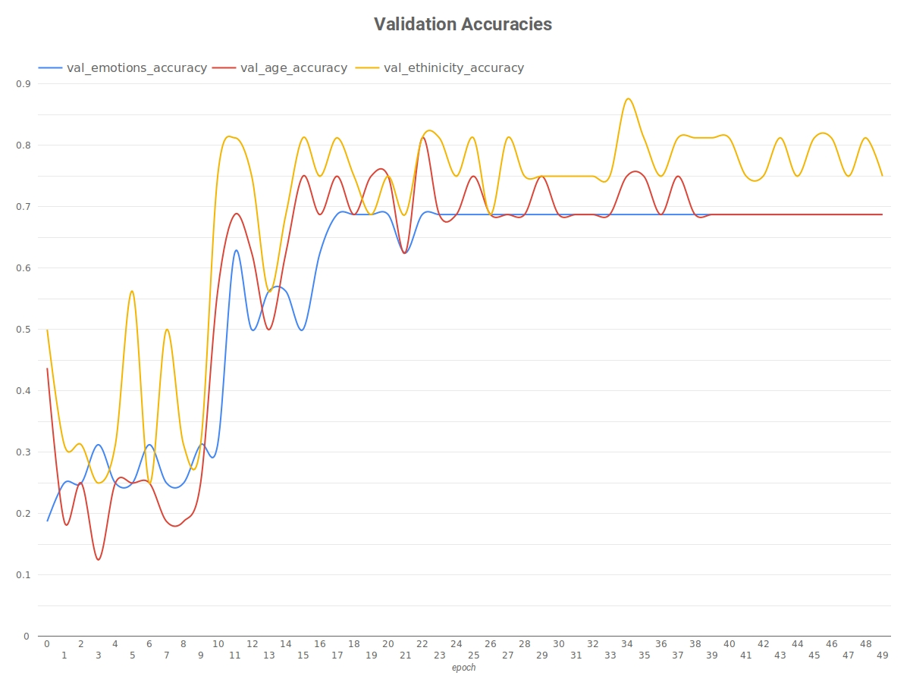
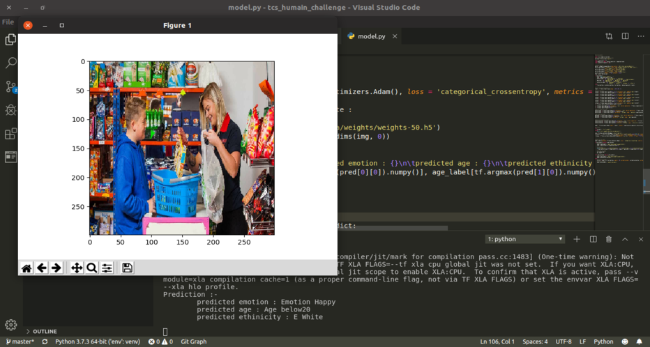
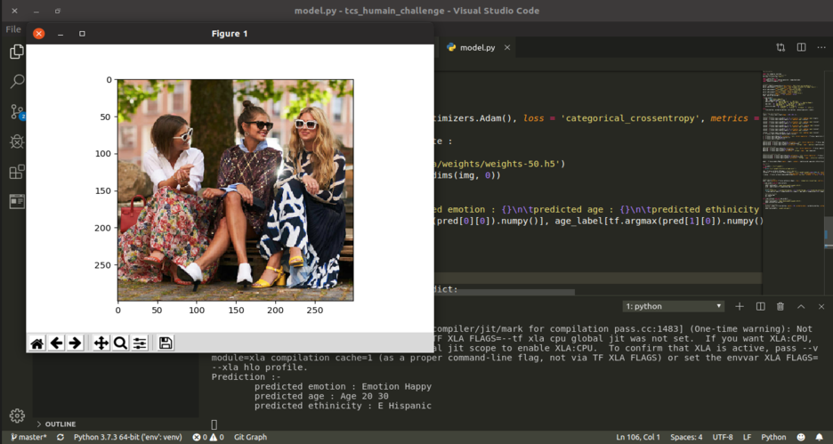

# Facial Recognition
<p>
  
  <a href="https://github.com/probhakarroy/tcs_humain_challenge#readme">
    
  </a>
  <a href="https://github.com/probhakarroy/tcs_humain_challenge/graphs/commit-activity">
    
  </a>
  <a href="https://github.com/probhakarroy/tcs_humain_challenge/blob/master/LICENSE">
    
  </a>
</p>

> Multi-Task Deep Learning Network For Emotion, Age, Ethinicity Classification.
> Created For TCS HumAIn Challenge.

## Install
```sh
$pip3 install --upgrade -r requirements.txt
```

## Usage
```sh
$python3 model.py --help
usage: model.py [-h] [--predict] [--evaluate] [--train] [--epoch EPOCH]
                [--epoch_weight EPOCH_WEIGHT]

Multi-Task Learning Network.

optional arguments:
  -h, --help            show this help message and exit
  --predict             Use the model to predict an image from url.
  --evaluate            Evaluate the model.
  --train               Train the model.
  --epoch EPOCH         No. of Epochs. [Default : 50]
  --epoch_weight EPOCH_WEIGHT
                        Load the weight from trained epoch. [Choices : 23, 26,
                        49, 50] [Default : 50]
```

A Multi-Task Deep Learning Network For Emotion, Age, Ethinicity Classification trained 
using the dataset provided by TCS of 120 labeled images [Face_Recognition.json] using TensorFlow.

## Dataset
The dataset was provided by TCS HumAIn in a JSON File.<br>
The dataset generator script [dataset_generator.py] in model_utils is used to parse the 
json file and download the images then reshape and covert them to tf.Tensor of shape ```299 x 299 x 3``` and also parse the labels and encode them to one-hot vectors.<br>

Some Data Samples :- <br>
 {.center}
 {.center}
<br>

Two datapoints out of 120 datapoints cannot be decoded using TensorFlow hence 118 images 
were processed with tensorflow and then data augmented to produce 472 datapoints and then
used to create three tf.data.Dataset input pipeline for training, validation and testing
of the tensorflow model.

```sh
  Total no. of datapoints after data augmentation : 472
	Total no. of datapoints in train set : 354
	Total no. of datapoints in validation set : 94
	Total no. of datapoints in test set : 23
```

Classes :-<br>
```sh
Emotion : {'Emotion_Neutral', 'Not_Face', 'Emotion_Sad', 'Emotion_Angry', 'Emotion_Happy'}
Age : {'Age_above_50', 'Age_30_40', 'Age_20_30', 'Age_40_50', 'Age_below20', 'others'}
Ethinicity : {'E_Hispanic', 'E_White', 'E_Black', 'E_Asian', 'E_Indian', 5: 'others'}
```


## Model Architecture
 {.center}


## Training
The model was trained on Google Colab using Nvidia Tesla T4 GPU.

Model Metrics :-<br>






Saved trained epoch weights of the model with best validation accuracies for the
epoch - 23, 26, 49, 50 can be found in ```sh model_data/weights``` folder. 


## Validation
Best Validation Accuracy for the model :-<br>

```sh
Emotion Accuracy : 68.75%
Age Accuracy : 81.25%
Ethinicity : 81.25%
```

## Test
Test Metrics for the model with best epoch weights :-<br>

```sh
loss: 5.9781 - emotions_loss: 1.5415 - age_loss: 1.9576 - ethinicity_loss: 1.9338 - emotions_accuracy: 0.6522 - age_accuracy: 0.5217 - ethinicity_accuracy: 0.5652
```

## Prediction
Sample Prediction of the model :- <br> 




```sh
Tested In Ubuntu-19.04 with Python 3.7.3.
```